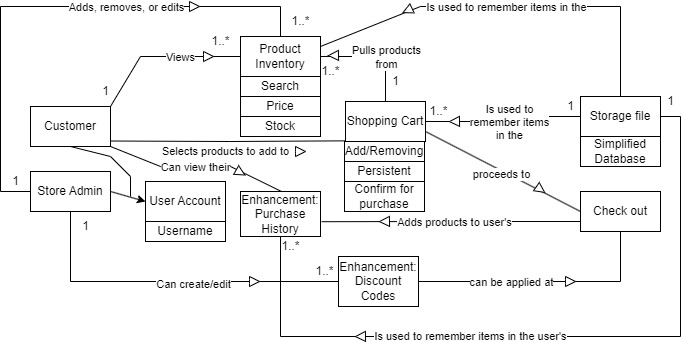

# PROJECT Design Documentation

## Team Information

* Team name: Team 3 - Bookstore
* Team members
  * Rylan Arbour
  * Cole DenBleyker
  * Ryan Robison
  * Jack Hunsberger
  * Xin Huang

## Executive Summary

The main intention of this project is to act as an e-store, with a focus in selling books. Users are able to login and add products to their shopping cart. They are also able to remove products from their shopping carts. If a user logs in as an admin then they gain access to edit products - being able to change the price, cost, quantity, name, and description. Admins can also add and remove products. The e-store also has promotional codes that admins can create and remove, and users can apply to get a discount on the total cost of their shopping cart. Users can also view their purcahse history.

### Purpose

To create a robust E-store service in which customers can interact with an inventory of available items to add to their cart and checkout with.

### Glossary and Acronyms

| Term | Definition |
|------|------------|
| SPA | Single Page |
| MVP | Minimum Viable Product |
| DAO | Data Access Object |

## Requirements

This section describes the features of the application.

### Definition of MVP

The MVP must provide a way for users to log in and authenticate, view products, add them to their cart, and check out. An admin user must be able to add products to the inventory and edit them.

### MVP Features

* Minimal authentication for users and admins, login and logout system
* Customer can see, and search products in the inventory
* Customer can add and remove products to cart and check out
* Administrator can add, remove, or edit products in the inventory
* Users, cart data, and inventory data is persistent between instances

### Enhancements

* Users can view their purchase history
* Admins can create and remove discount codes that users can apply

## Application Domain

This section describes the application domain.

A customer has their own user account associated with a product history and shopping cart. In the estore, the customer can add items from the inventory to their cart, apply discount codes, and check out. Each product has a price, description, and stock that can be changed by the admin user.

## Architecture and Design

This section describes the application architecture.

### Summary

The following Tiers/Layers model shows a high-level view of the webapp's architecture.

The e-store web application, is built using the Model–View–ViewModel (MVVM) architecture pattern. 

The Model stores the application data objects including any functionality to provide persistance. 

The View is the client-side SPA built with Angular utilizing HTML, CSS and TypeScript. The ViewModel provides RESTful APIs to the client (View) as well as any logic required to manipulate the data objects from the Model.

Both the ViewModel and Model are built using Java and Spring Framework. Details of the components within these tiers are supplied below.

### Overview of User Interface

This section describes the web interface flow; this is how the user views and interacts
with the e-store application.

After logging in from the log in screen, the user is shown navigation menu. From this menu a normal user is shown buttons to access their cart, the product inventory, and their purchase history. If an admin is logged in, they will see the admin page button instead of the shopping cart button. The shopping cart page shows products the user has added to their cart and a checkout button allows them to check out. The product inventory shows all available products. A user can click on each product to view additional details. Add to cart and remove from cart buttons are also visible. The purchase history meny allows the user's previously purchased products. On the admin page, multiple buttons show different views for adding, removing, and editing products. The admin can also create and delete coupon codes.

### View Tier
Upon starting the app, the user is directed to a page showing the login component through the routing module. After logging in, the user's username is stored in the login-state service where it can be referenced in other components. The login button redirects to the navigation menu which has links that lead to the shoppingcart component (or admin-page component if the user is logged in as admin), the product-user-inventory component, and the purchase-history component. The products in the inventory can be clicked on to show the product-user-detail component which contains data relating to the specified product. The inventory has a search component embedded above the list of inventory items to search for a specified item. The admin-page component embeds the admin-buttons component which allows the administrator to create, edit, or remove products, as well as create and remove discount codes. Finally, the purchase-history component holds a simple list of products which is changed after checkout.

### Viewmodel & Model Tier
The following UML class diagrams provide an overview of how the model tier interacts with the other tiers of the program.

The product class is used for any product that the store admin wants to add to the store inventory. It contains information about the product such as its name, price, and description. An id is associated with each product in order to make sure each product is treated differently by the system. 

Additionally, each user is also associated with an instance of the User class. The user class contains the user's username and the unique id connected with the that username.

## OO Design Principles

### Single Responsibility
The Single Responsibility principle states that every class should only have one “job” or
responsibility. When designing the e-store, it was important to be able to create distinctions
between the controller, model, and persistence sections of the back-end. To do so, each
component was given its own “main” class: ProductController for the controller, Product for the
model, and the ProductFileDAO for the persistence.

Each of these classes has one major role. The job of the Product class is to provide a
structure that can hold all of the data a single product requires. It also provides ways to access
and mutate this data, allowing other classes to interact and update products in the e-store
inventory.

The job of the ProductFileDAO class, which implements the ProductDAO interface, is in
charge of maintaining the file persistence for the e-store. When an admin adds or removes
products from the inventory, methods from the ProductFileDAO class are called to carry out the
requests. At first, it may seem this class does many things; it creates the .json file to store the
product objects, has a representation of the store inventory as a map, updates, deletes, creates,
and searches for products… Still, this class has a single responsibility, and that is to bridge the
gap between Product java objects and product .json objects.

Finally, the ProductController class is tasked with taking API requests from the user and
returning responses using HTTP responses. It is not concerned with the file storage aspect of the
e-store, as it hands off the requests to an instance of the ProductFileDAO class to be dealt with.
The ProductController has mappings for post, put, get, and delete

### Open/Closed
The Open/Closed principle states that base software functionality should be extendable
while avoiding changing the basic functionality of the application. This principle is closely
mirrored by the use of interfaces or inheritance of other classes.

The persistence section of the e-store, ProductFileDAO, implements the ProductDAO
interface. This allows for the preservation of the base functionality while also allowing for
extendability of features in the class that implements the interface. Further, ProductFileDAO
uses the Spring framework @component tag, which tells the application that it is to be injected
into the class with the @RestController tag. In the e-store, the ProductController class takes the
dependency injection of the ProductFileDAO which causes the Spring framework to create a
single instance of the DAO and provide it to the constructor of the controller. Dependency
injection facilitates the Open/Closed principle because if extensions of functionality are created
in the DAO class, it can still be injected as usual into the controller.

The e-store only uses a single interface, the ProductDAO. This interface will likely be
useful for further additions to the production, such as the creation of new DAO modules to allow
for shopping cart persistence across users and purchase history persistence. It may be useful in
the future to create an interface for a controller class for those other cases where file persistence
is required. When designing the Angular front end portion of the project, the Open/Closed
principle should be used to allow for extensions to the file persistence system once the shopping
cart and product history are implemented.

### Law of Demeter
The law of Demeter is a principle that is intended to reduce coupling between code where
coupling is not needed. This is in principle a file should only call upon or talk to itself or only its
neighbors. For example, it can talk to itself A or its neighbor through A.B but it should not try to
call A.B.C. it should instead try to get any information it may need through a method of B. such
that B may call and talk to C to get information and then B using this method can be called by A.
This is to help lower the amount of coupling between files thus reducing the dependencies.

As it stands, we can see cases of this throughout our current code. Looking at the product
controller we can see in that while cases such as the update product and get product both need to
call upon the product Dao to do these functions, they do not actually do any calculation
themselves with it they simply check if it is their and return what was given. Instead of the
controller itself needing to go and update or change the products themselves it simply asks the
product Dao to do it for the controller and then receives the result of the action.

While we do have some cases that can be pointed out as possibly being use cases of this
law in action, we do not have any cases where the law needs to be applied. This is most likely
due to the project still being in an early state with few files. For the future to better adhere to
these rules we need to make sure we continue to only uses attributes of the current file and call
methods of direct neighbors and not have any methods that reach through these direct neighbors.
This law will most likely become more important as we continue to expand our current project
and start adding more classes and features such shopping cart, UI, discount codes, and the rest.

### Dependency Inversion/Injection
The ideas of dependency inversion/injection were also used during the
implementation of our code. As mentioned before we have to store products for most of
our other implementation to work. Due to this, we have to have a catalog of items. This
may be the case for real stores however for us, the catalog has to be implemented at
run time. During our demonstration of the initial implementation of our Estore, we
demonstrated that we can create products at the run time as a user showing the
injection. 

Furthermore, to create a product we only have to enter a name and a price,
and the other details of the product are automatically implemented unless specified. We
plan to use this idea in the future with the accounts we are going to implement as all
users of our store need to implement their username and password. Furthermore in the
future as a group, we need to create a coupon system as an enchantment of our
project. In the future, we need to use the ideas of dependency inversion/injection to
make the coupon system function as well as the coupons like accounts and products
are not something that is automatically there. To better adhere to the principle it may be
advisable to make it so we only need to enter a name for a product and set the price
immediately to zero as well. 

For dependency inversion, it could be possible to implement a coupon concerning a specific product all at once instead of separating the
process as a way to implement dependency inversion as to combine the process.

## Static Code Analysis/Future Design Improvements

* In the userFileDAO the use of the BufferedWriter could lead to potential issues. In order to fix this, try-with-resources or finally should be used in order to prevent possible problems with not properly closing the BufferedWriter
* In the UserController, a condition in the searchUsers function always evaluates to true. At first it may seem this is not a problem, but this important null check needs to be changed as .equals comparisons against null always return false. == null should be used instead.
* Because of the equals() function is overridden inside the product class, so the hashCode() function should also be overridden. This is because in the Java Language Specification, these two functions have a "contract" with one another and the two should always be overridden together

## Testing
All tests pass without issues.

### Acceptance Testing
Three of the acceptance criterion failed during cross-team testing:

* Given that I am on the Products page when there are no products in the inventory I see a message indicating that that there are no products available.
* Given I am viewing the admin page when I click a button on the page labelled "Create new product" then I expect to be able to fill in details about a new product I want to sell that will then appear on my storefront.
* Given my username as a customer when I login to the website then I expect to be able to login and see my carts. 

Many of these issues were due to the estore simply not being finished by the end of sprint two, such as for the final test the UI for the shopping cart page was not yet implemented. The other criterion failed similarly due to simple UI mistakes or missing elements and were quickly and easily fixed. Now, all acceptance tests pass.

### Unit Testing and Code Coverage

There are no major anomalies for the unit test code coverage. Unit tests were designed to thoroughly cover each aspect of the java code, so 90% was our target coverage percentage. 
